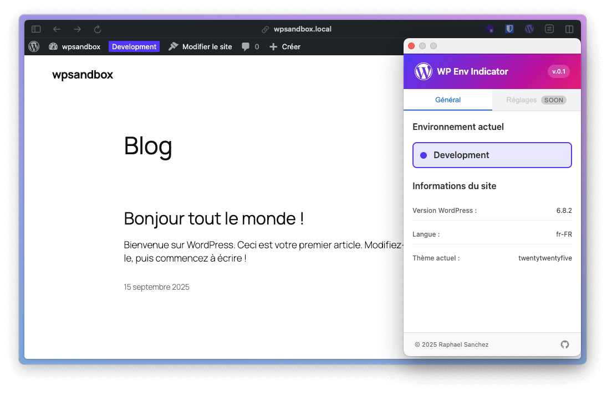

# WordPress Environment Indicator

A Chrome extension that automatically detects WordPress environments (development, staging, production) and displays a corresponding badge in the WordPress admin bar.



## Objective

Prevent confusion between local or test environments and production by clearly displaying the current environment in the WordPress interface.

## Features

- **Automatic detection** of environments based on:
  - Domains: `.dev`, `.test`, `.local`
  - Hostnames: `localhost`, `127.x.x.x`
  - Staging patterns: `staging`, `stage`, `preview`, `demo`, `test`
- **Visual badge** in the WordPress admin bar with SVG icons
- **Popup interface** with General tab displaying environment information
- **WordPress detection**: Version, language and current theme
- **Distinctive colors**:
  - 🔵 **Development**: Purple (`#4f39f6`)
  - 🟣 **Staging**: Pink (`#e60076`)
  - ⚪ **Production**: No badge (production environment)

## Installation

1. Download or clone this repository
2. Open Chrome and go to `chrome://extensions/`
3. Enable "Developer mode"
4. Click "Load unpacked extension"
5. Select the extension folder

## Usage

1. Navigate to a WordPress site
2. The extension automatically detects the environment and WordPress information
3. A colored badge with icon appears in the WordPress admin interface
4. Click on the extension icon to see details in the popup
5. The popup displays:
   - Detected environment (development/staging)
   - WordPress version
   - Site language
   - Current theme

### Automatic Detection

The extension automatically detects:

- **Development environments**: `localhost`, `127.x.x.x`, `.dev`, `.test`, `.local` domains
- **Staging environments**: hostnames containing `staging`, `stage`, `preview`, `demo`, `test`
- **WordPress information**: version, language, theme via DOM analysis

## Development

### Project Structure

```
chrome-wordpress-env-indicator/
├── manifest.json          # Extension configuration (Manifest V3)
├── background.js          # Service worker
├── scripts/
│   └── content.js         # Script injected into WordPress pages
├── popup/
│   ├── popup.html         # Popup interface with tabs
│   ├── popup.css          # Popup styles (BEM methodology)
│   └── popup.js           # Popup logic and communication
├── styles.css             # Styles injected into WordPress admin
├── images/                # Extension icons (16px, 32px, 48px, 128px)
│   ├── icon16.png
│   ├── icon32.png
│   ├── icon48.png
│   ├── icon128.png
│   └── logo.svg           # Custom WordPress logo
└── locales/               # Translation files (v0.3)
```

### Technologies Used

- **Vanilla JavaScript** (no framework)
- **Chrome Extensions Manifest V3**
- **CSS3** with responsive support and BEM methodology
- **Chrome Storage API** for data persistence
- **Chrome Scripting API** for script injection
- **SVG** for badge icons
- **MutationObserver** for page change detection (SPA)
- **Chrome Runtime API** for component communication

## Roadmap

### v0.1 (MVP) - Current

- ✅ Automatic environment detection (development, staging)
- ✅ Visual badge with SVG icons in WordPress admin bar
- ✅ Popup interface with General tab
- ✅ WordPress version, language and theme detection
- ✅ Single-page application (SPA) support
- ✅ Distinctive colors per environment
- ✅ Component communication via Chrome APIs

### v0.2 - Next

- 🔄 Settings tab in popup (interface ready)
- 🔄 Custom domains for staging
- 🔄 Badge color customization
- 🔄 User preferences saving

### v0.3 - Future

- Internationalization (EN, FR, ES)
- Automatic browser language detection

## Contributing

Contributions are welcome! Feel free to:

- Report bugs
- Suggest improvements
- Submit pull requests

## Authors

- [Raphael Sanchez](https://raphaelsanchez.design) - Frontend Developeur

## License

This project is licensed under the MIT License. See the `LICENSE` file for more details.

## Useful Links

- [Chrome Extensions Documentation](https://developer.chrome.com/docs/extensions/)
- [Manifest V3 Migration Guide](https://developer.chrome.com/docs/extensions/migrating/)
- [Chrome Extensions Best Practices](https://developer.chrome.com/docs/webstore/best-practices/)
